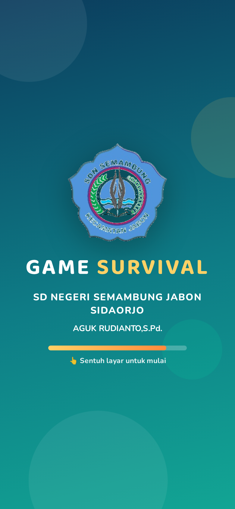
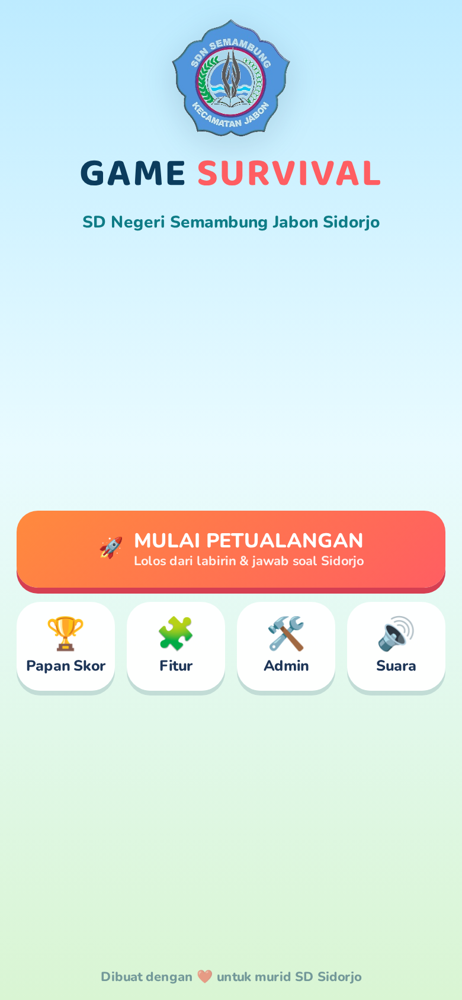
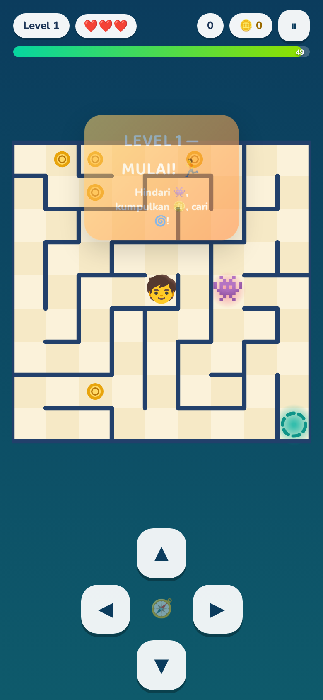
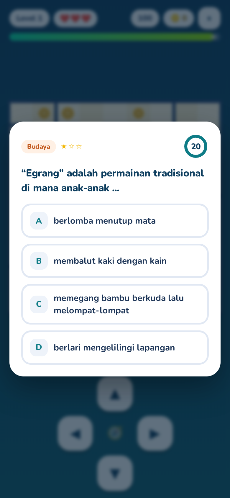
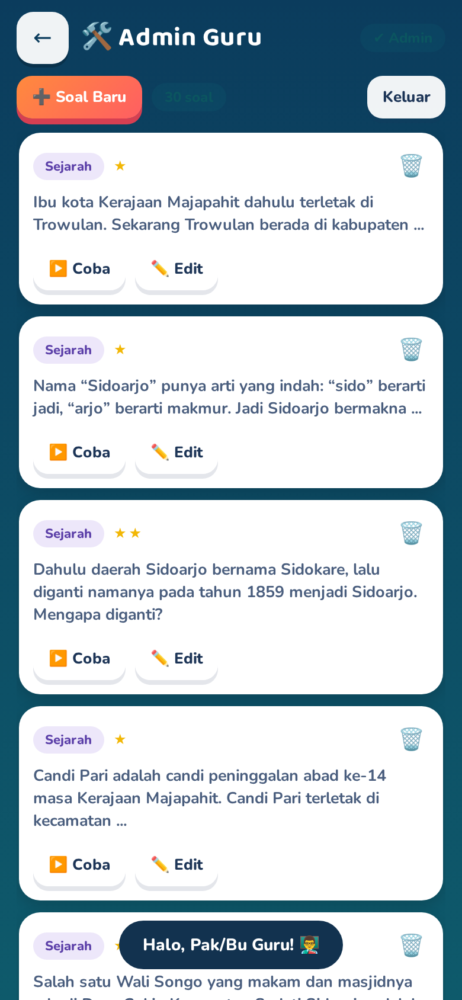
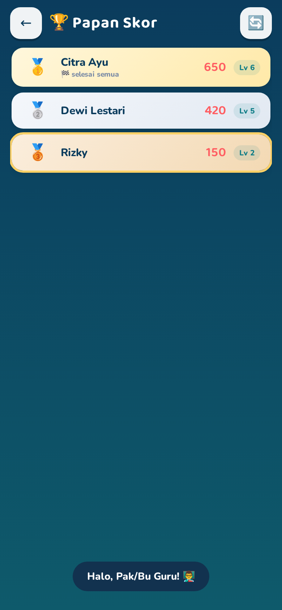

# 🧩 Game Survival Labirin — SD Negeri Semambung Jabon

Game edukasi **survival labirin** untuk murid SD. Dibangun dengan **Python (Flask)**
sebagai backend + HTML5/CSS/JS sebagai frontend — dijalankan langsung di **browser HP
Android**, tanpa instal aplikasi.

> Dibuat untuk: **SD NEGERI SEMAMBUNG JABON SIDAORJO**
> Guru: **AGUK RUDIANTO, S.Pd.**

---

## ✨ Fitur

| Fitur | Keterangan |
|---|---|
| 🏃 Survival labirin | 6 level makin besar: kumpulkan koin 🪙, hindari monster 👾, cari gerbang 🌀 sebelum waktu habis |
| 🧠 Soal Sidorjo | Tiap level lolos harus menjawab soal **sejarah, kearifan lokal & budaya** masyarakat Sidoarjo (30 soal bawaan, bisa ditambah guru) |
| 💾 Simpan sesi otomatis | Progres (level, nyawa, skor, koin) tersimpan per nama. Masuk lagi dengan nama yang sama → **Lanjutkan** |
| 🏆 Papan skor | 10 besar skor tertinggi, medali 🥇🥈🥉, tanda bagi yang menyelesaikan semua level |
| 🛠️ Admin guru | Login → **tambah / edit / coba / hapus** soal, ubah kata sandi |
| 🎵 Efek suara | Koin, benar/salah, level, kemenangan, detak waktu — plus **getaran HP** (Web Audio, tanpa file audio) |
| 📱 Android-first | Layar pas di HP (portrait), **full sentuhan** (tombol panah + usap), **anti pull-to-refresh** saat scroll |
| 🎬 Animasi | Splash logo, konfeti, portal berputar, monster melayang, banner level, transisi layar |
| ⏸ Jeda | Tombol jeda + otomatis jeda saat HP dikunci/aplikasi pindah |

---

## 🌐 Cara 2: Upload ke GitHub Pages (main dari HP tanpa PC!)

Game bisa di-deploy ke **GitHub Pages** — murid tinggal buka tautan di browser
HP, tanpa instalasi apa pun.

1. Buat repository di github.com (misal `survival-labirin`), lalu push isi
   folder ini (perintah lengkap ada di akhir README).
2. Buka **Settings → Pages → Build and deployment → Source: GitHub Actions**
   (sudah otomatis dipakai workflow `.github/workflows/deploy.yml`).
3. Tunggu beberapa detik di tab **Actions** — setelah hijau, game hidup di
   `https://<username-anda>.github.io/survival-labirin/`

### Dua mode permainan
| | Mode **PC** (`python app.py`) | Mode **HP** (GitHub Pages) |
|---|---|---|
| Soal | dari `data.json`, **bisa CRUD via menu Admin** | 30 soal bawaan (fixed) |
| Papan skor | **bersama** semua pemain | per HP (setiap murid punya skornya sendiri) |
| Simpan sesi | di server (satu HP pun bisa pindah-pindah) | di HP masing-masing (localStorage) |
| Menu Admin | ✅ aktif | 📡 info saja (butuh server) |

> Mode dideteksi otomatis saat halaman dibuka — tidak perlu diatur apa pun.
> Saran: di kelas, jalankan mode PC (skor bersama + admin), dan bagikan tautan
> GitHub Pages untuk latihan di rumah.

## 📤 Push ke GitHub (dari komputer Anda)

```bash
# 1) buat repo di github.com dulu (web), lalu:
cd survival-labirin
git init -b main
git add -A
git commit -m "Game Survival Labirin - SDN Semambang Jabon Sidorjo"
git branch -M main
git remote add origin https://github.com/<USERNAME-ANDA>/survival-labirin.git
git push -u origin main
```

Setelah itu **Settings → Pages → Source: GitHub Actions**. Tautan game:
`https://<USERNAME-ANDA>.github.io/survival-labirin/`

---

## ▶️ Cara Menjalankan (di PC/Laptop)

```bash
cd survival-labirin
pip install -r requirements.txt
python app.py
```

Buka di browser: **http://localhost:5000**

### Cara main dari HP Android (kelas)
1. Pastikan HP dan PC terhubung ke **Wi-Fi yang sama**.
2. Cari IP PC. Contoh di Windows:
   ```
   ipconfig
   ```
   (misal hasilnya `192.168.1.10`)
3. Di browser HP ketik: **http://192.168.1.10:5000**
4. Jika tidak terbuka: izinkan port **5000** di firewall PC.

> Server sudah default `0.0.0.0` sehingga bisa diakses dari HP lain di jaringan
> yang sama. Bisa juga: `python app.py --port 8000`.

---

## 🔑 Akun Admin

- Menu **Admin** (beranda) → kata sandi bawaan: **`admin123`**
- Setelah masuk, ubah sandi lewat tombol **🔑 Ubah kata sandi admin**.
- Sandi bisa ditetapkan lewat environment saat pertama kali menjalankan:
  `ADMIN_PASSWORD=sandibaru python app.py`

## 🏫 Logo Sekolah

Logo asli sudah terpasang di **`static/logo-sekolah.png`** (background transparan).
Untuk mengganti lagi: letakkan file baru di folder `static/`, lalu ubah
`src="/static/logo-sekolah.png"` di `static/index.html` (splash, beranda, dan
icon di `<head>`).

## 📚 Data & Backup

Semua data tersimpan di **`data.json`** (bank soal, sesi murid, papan skor).
File ini bisa disalin untuk backup, atau diedit manual saat server mati
(jangan lupa formatnya harus tetap JSON valid).

- Menambah soal manual: tambahkan entri di `data.json` bagian `"questions"`
  dengan `id` unik, `category` (Sejarah / Kearifan Lokal / Budaya),
  `difficulty` (1–3), `question`, `choices` (4), `answer` (0–3), `explanation`.
  Jangan lupa naikkan `next_qid`.

## 🎛️ Mengatur Kesulitan Game

Di file `static/js/game.js`, bagian paling atas:

```js
const STAGES = [
  { cols: 9,  rows: 9,  monsters: 1, time: 50 },  // Level 1
  ...
  { cols: 19, rows: 19, monsters: 4, time: 95 },  // Level 6
];
```

Atur ukuran labirin, jumlah monster, dan batas waktu tiap level.
Waktu menjawab soal: `QTIME` (detik) di `static/js/app.js`.

## 🕹️ Kontrol

- **Tombol panah** di bawah layar — tahan untuk jalan terus.
- **Usap (swipe)** di atas labirin — satu arah per usapan.
- **Keyboard** (untuk uji di PC): panah / WASD.

---

## 📸 Tampilan Game

| Splash | Beranda | Gameplay |
|---|---|---|
|  |  |  |

| Soal | Menu Admin | Papan Skor |
|---|---|---|
|  |  |  |

---

### Struktur folder

```
survival-labirin/
├── app.py                 # backend Python (Flask) + 30 soal bawaan
├── requirements.txt
├── data.json              # dibuat otomatis saat pertama jalan
├── README.md
└── static/
    ├── index.html         # semua layar game
    ├── logo-sekolah.png   # logo sekolah (transparan)
    ├── css/style.css
    └── js/
        ├── audio.js       # efek suara (Web Audio API)
        ├── game.js        # mesin labirin, monster, render
        └── app.js         # navigasi, soal, sesi, admin
```
